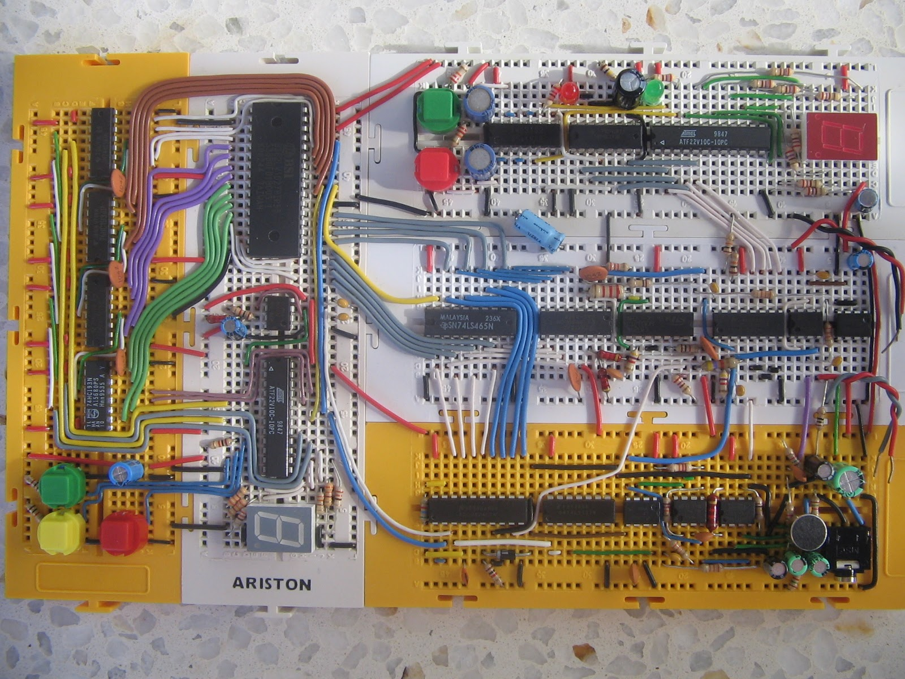

# Grabadora
Sistema de almacenamiento y reproducción digital de audio realizado en la asignatura de subsistemas analógicos, de ingeniería de telecomunicación.

El sistema se compone de:
- Una etapa de entrada, que digitaliza una señal de audio tomada con un micrófoco electret.
- Una etapa de control y almacenamiento, que permite grabar aproximadamente 12 segundos de audio y reproducirlos del derecho y del revés.
- Una etapa de salida, que convierte la señal a analógico y la reproduce por unos cascos.
- Una etapa de control de volumen, para subir o bajar el volumen de la salida de audio.

## License

Todos estos productos están liberados mediante [Creative Commons Attribution-ShareAlike 4.0 International License](http://creativecommons.org/licenses/by-sa/4.0/).  
_All these products are released under [Creative Commons Attribution-ShareAlike 4.0 International License](http://creativecommons.org/licenses/by-sa/4.0/)._
